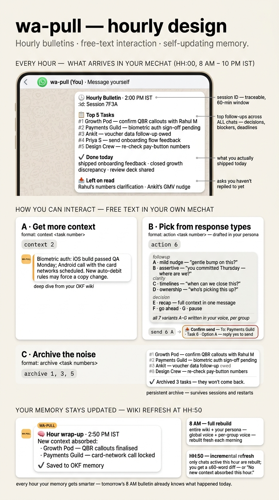

# hourlyB — Your WhatsApp AI Chief of Staff

**hourlyB** is an AI bot that runs inside your WhatsApp MeChat (the chat you have with yourself). Every hour, it reads all your non-archived chats, finds what needs your attention, and drops a ranked bulletin of the top things to follow up on. A real-time pulse monitor watches for people tagging you, asking questions, or fast-moving threads — and pings you with context, a task, and ready-to-send reply options.

No apps to install. No dashboards to check. It lives where you already work.

```
curl -sSL https://raw.githubusercontent.com/sameer-hoda/wa-pull/main/install.sh | bash
```



## What it does

### Hourly Bulletin
Every hour from 8 AM to midnight IST, you get a compact ranked list of what's pending across all your WhatsApp conversations:

```
🕒 *Hourly Bulletin* · 14:00 IST · July 25
🆔 Session `A3F2B9C1`

📋 *Tasks* (20)

🔴 *1* Finalize Q3 budget sign-off — finance lead waiting 3h ⚠️
🟠 *2* Unblock iOS app store review · dev team · 24h
🟡 *3* Fix dashboard impressions counter −12% · 48h
🟢 *4* Vendor onboarding for Q3 · ops · 24h
...

• archive 1,3 • context 2 • action 4 • send 4A • more
```

Each task is scored using a 7-step rubric that weighs blocking status, deadlines, unanswered questions, money/compliance exposure, and freshness. Tasks render in a compact one-line format — urgency color, title, who's waiting, and how long.

### Pulse Monitor
A real-time daemon scans all your non-archived chats every 10 seconds. When something needs you — a direct question, a @-tag, a fast-moving thread — it drops a pulse alert:

```
pulse @ 14:06
📍 Priya Sharma

Priya asked about the vendor contract you mentioned earlier.
A response is needed before EOD.

📋 *Task created:*
🟡 *21* Review vendor contract draft · you · 2h

quick response to Priya Sharma:
A. Hey, reviewed the contract — looks good. Moving forward.
B. Can you share the draft again? Need to review.
C. Reviewed — let's discuss the approach tomorrow.

send 21 A/B/C
```

Pulse tasks get appended to your hourly task list with normal numbering. Reply with `send 21 A` to fire off the pre-drafted response. The LLM only fires a pulse when something is genuinely material — directions, instructions, and one-off logistics don't trigger alerts.

### On-Demand Commands

| Command | What it does |
|---------|-------------|
| `/pull` | Generate a fresh bulletin on demand |
| `/hourlyb` | Full hourly bulletin |
| `archive 1,3,5` | Dismiss tasks (persists across sessions and restarts) |
| `context 2` | Deep dive on task 2 using your knowledge base |
| `action 6` | 7 persona-aware response variants for task 6 (A–G) |
| `send 6 A` | Send option A to the source chat → confirm with `yes` |
| `more` | Get the next batch of tasks |

Action variants: A (mild follow-up), B (assertive follow-up), C (clarify timelines), D (clarify ownership), E (full recap), F (decision: go ahead), G (decision: pause). All drafted in your voice based on a global + per-group persona profile.

## Architecture

```
WhatsApp (phone) ←→ Go Bridge (whatsmeow) ←→ hourlyB (Python)
  · QR auth                · REST API :8080     · hourly bulletin
                           · SQLite DBs         · 7-step task extraction
                                                · pulse monitor
                                                · OKF knowledge base
                                                · persona-aware replies
```

The Go bridge (a lightweight [whatsmeow](https://github.com/tulir/whatsmeow) wrapper) connects your phone via QR auth and exposes a local REST API. hourlyB reads the bridge's SQLite databases, uses Gemini to extract tasks and context, and sends messages back through the bridge API. Everything runs on your machine — no cloud dependencies beyond the Gemini API call.

## Quick Start

### 1. One-line install
```bash
curl -sSL https://raw.githubusercontent.com/sameer-hoda/wa-pull/main/install.sh | bash
```

### 2. Add your Gemini API key
Open `~/.env` and replace the placeholder with your actual key:
```bash
nano ~/wa-pull/.env
```
Change this line:
```
GEMINI_API_KEY="your_gemini_api_key_here"
```
To your actual key:
```
GEMINI_API_KEY="AIza..."
```
Get a free key at [aistudio.google.com/apikey](https://aistudio.google.com/apikey). The free tier is generous — enough for hundreds of hourly bulletins.

### 3. Build and start the WhatsApp bridge
```bash
git clone https://github.com/sameer-hoda/wa-slash-commands
cd wa-slash-commands/bridge
go build -o wa-bridge
./wa-bridge
```
Scan the QR code in WhatsApp → Settings → Linked Devices → Link a Device.

### 4. Start hourlyB
```bash
cd ~/wa-pull && ./start.sh
```

The bot sends a welcome message to your MeChat and begins hourly bulletins and real-time monitoring.

## How it works under the hood

### Task extraction (v4 rubric)
A 7-step process that runs against your OKF knowledge base + recent chat activity:
1. **Ignore** — bot output, fragments, forwarded articles, acks
2. **Find open loops** — unanswered questions, unfulfilled commitments, deadlocked decisions, at-risk metrics
3. **Merge** — one task per thread, cross-group duplicates merged
4. **Score** — additive: +40 blocked, +30 money/compliance, +25 deadline ≤24h, +20 unanswered >4h, +15 overdue, +10 freshness, −30 chatter
5. **Write title** — ≤80 chars, must name a person or number, imperative verb
6. **Return JSON** — 14 fields from title through score reasoning
7. **Self-check** — dedup, title length, critical count ≤2, ≥3 `is_new`

### OKF Knowledge Base
The Open Knowledge Format bundle is a directory of structured markdown files — one per chat — with summaries, open items, key decisions, recent activity, and participants. Rebuilt daily at 8 AM and incrementally updated every hour. Used by the LLM for context-aware task extraction and response drafting.

### Persona
The bot builds a global communication profile + per-group style notes from your outgoing messages. All reply drafts (action options, pulse responses) use these personas to match your actual voice — tone, message length, punctuation, emoji habits, language mix, and directness.

## Requirements

- **Python 3.10+** (tested on 3.12)
- **Go 1.21+** (for the bridge)
- **Gemini API key** (the [free tier](https://aistudio.google.com/apikey) is generous)
- **WhatsApp account** (bridge pairs via QR — no phone number needed on the server)

## Environment Variables

| Variable | Default | Description |
|----------|---------|-------------|
| `GEMINI_API_KEY` | — | **Required** |
| `GEMINI_MODEL_FAST` | `gemini-3.1-flash-lite-preview` | Model for all calls |
| `IST_START_HOUR` | `8` | First hourly bulletin (IST) |
| `IST_END_HOUR` | `24` | Last hourly bulletin (IST, midnight) |
| `TASKS_PER_PAGE` | `20` | Tasks per bulletin |
| `MONITOR_ENABLED` | `1` | Real-time pulse monitor on/off |
| `MONITOR_POLL_INTERVAL` | `10` | Seconds between all-chats scans |
| `MONITOR_COOLDOWN_SECONDS` | `300` | Per-chat cooldown after alert |

## Development

```bash
# Clone
git clone https://github.com/sameer-hoda/wa-pull && cd wa-pull

# Setup
python3 -m venv venv && source venv/bin/activate
pip install -r requirements.txt
cp .env.example .env
# Edit .env — replace "your_gemini_api_key_here" with your actual Gemini API key

# Tests
python3 -m pytest tests/ -v

# Run (bridge must be running)
python3 main.py
```

## License

MIT